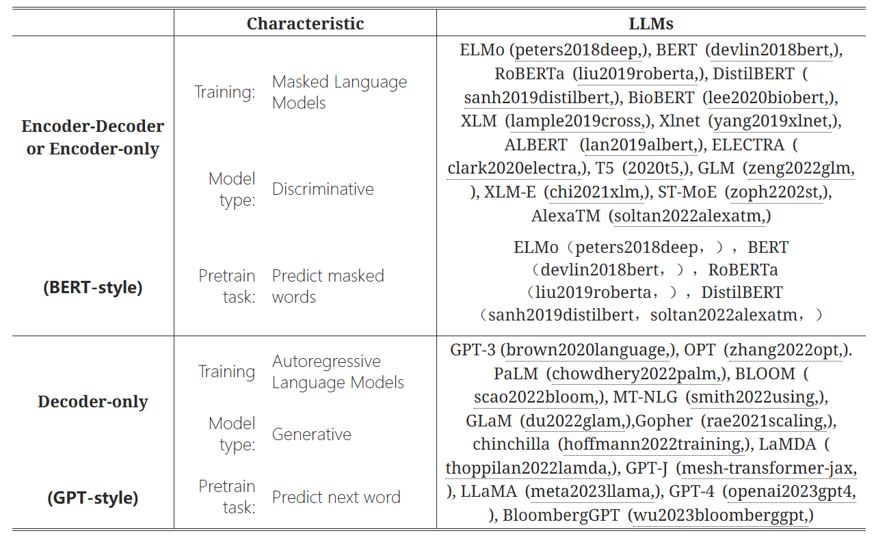

近期大语言模型迅速发展，让大家看得眼花缭乱，各个模型之间的关系也让人看的云里雾里。最近一些学者整理出了 ChatGPT 等语言模型的发展历程的进化树图，让大家可以对LLM之间的关系一目了然。

> - 大预言模型的进化树： https://blog.csdn.net/hawkman/article/details/130641688
>
> - 从关键概念到应用：深入了解大规模语言模型（LLM）：https://blog.csdn.net/universsky2015/article/details/139382354

- 论文(Harnessing the Power of LLMs in Practice: A Survey on ChatGPT and Beyond)：[https://arxiv.org/abs/2304.13712](https://link.zhihu.com/?target=https%3A//arxiv.org/abs/2304.13712)

- Github相关资源：[https://github.com/Mooler0410/LLMsPracticalGuide](https://www.github.com/Mooler0410/LLMsPracticalGuide)

<!-- more -->

## 1.LLMs的进化树图

现代语言模型的进化树追溯了近年来语言模型的发展，并强调了一些最著名的模型。同一分支上的模型的关系更近。

不同颜色分支代表的模型（开源模型由实心方块表示，闭源模型由空心方块表示）：

- 非灰色分支：基于Transformer的模型，也就是说LLM的核心架构就是Transformer
- 粉红色分支：仅编码器
- 绿色分支：编码器-解码器
- 蓝色分支：仅解码器


论文([Harnessing the Power of LLMs in Practice: A Survey on ChatGPT and Beyond]([https://arxiv.org/abs/2304.13712](https://link.zhihu.com/?target=https%3A//arxiv.org/abs/2304.13712)))：[https://arxiv.org/abs/2304.13712](https://link.zhihu.com/?target=https%3A//arxiv.org/abs/2304.13712)内容简介

- 仅解码器模型在LLMs的发展中逐渐占主导地位（在GPT-3提出后），而在早期其不如仅编码器和编码器-解码器。仅编码器的模型在BERT之后开始没落。
- Meta开发的所有LLMs都是开源的，但是LLMs越来越倾向闭源，如PaLM、LaMDA和GPT-4。因此，学术研究人员更难进行LLMs训练实验，基于API的研究可能成为主流（如字节白嫖OpenAI的Token）。
- 编码器-解码器模型仍然具有前景，因为基本都是开源的，但编码器-解码器的灵活性和多功能性受限。（作为工具为另外两者服务？）

下表是大预言模型的概述



## 2.LLMs的核心概念

**1.预训练和微调**

大模型的训练通常包含两个阶段：预训练(Pre-training)和微调(Fine-tuning)

- 预训练：在大规模无标注文本上进行自监督学习，获得通用的语言表征知识
- 微调：在特定的下游任务上，使用少量标注数据集对模型进行微调

**2.Tokenize和Subword**

含义：将文本转换为机器能够识别的数字化表示

- 传统的 Tokenization 方法是以单词为单位进行切分，但这会导致词汇表过大的问题
- Subword 方法通过将单词划分为更小的单元（如字符、字节对等），能够在保持词汇表大小可控的同时，更好地处理未登录词。

**3.Transformer架构**

Transformer是目前主流LLMs采用的基础架构。Transformer不采用RNN，采用自注意力机制(Self-attention)来捕捉序列中不同位置之间的依赖关系。Transformer的核心组成为:

- 编码器Encoder：由多个编码层组成，每个编码层包含自注意力机制和前馈神经网络
- 解码器Decoder：由多个解码层组成，每个解码层包含自注意力机制，前馈神经网络，和编码-解码注意力机制

**4.注意力机制**

注意力机制(Attention Mechanism)是LLMs的核心组件之一，它允许模型在生成词时，根据上下文动态地分配权重，从而捕捉长距离的依赖关系。常见的注意力机制有：

- 点积注意力（Dot-Product Attention)
- 加性注意力（Additive Attention）
- 多头注意力（Multi-Head Attention）

**5.核心概念之间的联系**

```
LLMs
|-- 思路: 预训练和微调
	|-- 自监督学习 Self-Supervised Learning
	|-- 下游任务适应 Downstream Task Adaptaion
|-- 架构: Transfomer
	|--- 编码器 Encoder
	|--- 解码器 Decoder
		|-- 自注意力机制 Self-Attention
			|-- 编码-解码注意力 Encoder-Decoder Attention
		|-- 前馈神经网络 Feed-Forward Network
```

