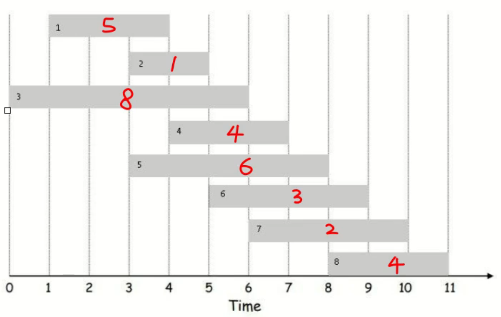

刷刷算法, 做做笔记

<!-- more -->

## 杂记

### 格式化输出

5位整数左对齐，高位用空格补齐: `printf("%5d", a);`

5位整数左对齐，高位用0补齐: `printf("%05d", a);`

### 按行读入

```c++
string str;
getchar();	// 吞掉回车
getline(cin, str);
```

### 字符串反转

第一种：对于C的字符数组，使用`string,h`中的`strrev`函数

```c
#include <iostream>
#include <cstring>
using namespace std;
 
int main()
{
    char s[]="hello";
    strrev(s);
    cout<<s<<endl;
    return 0;
}
```

第二种：对于C++中的string而言，使用`algorithm`中的`reverse()`函数

```c++
#include <iostream>
#include <algorithm>
using namespace std;
 
int main()
{
    string s = "hello";
    reverse(s.begin(), s.end());
    cout<<s<<endl;
    return 0;
}
```

第三种：自行实现

```c
#include <iostream>
using namespace std;
 
void Reverse(char *s,int n){
    for(int i = 0,j = n - 1;i < j;i++,j--){
        char c = s[i];
        s[i] = s[j];
        s[j] = c;
    }
}
 
int main()
{
    char s[]="hello";
    Reverse(s,5);
    cout << s << endl;
    return 0;
}
```

### 排序

使用`<algorithm>`中的`sort()`函数

sort()函数可以对给定区间所有元素进行排序。它有三个参数`sort(begin, end, cmp)`，其中`begin`为指向待`sort()`的数组的第一个元素的指针，`end`为指向待`sort()`的数组的最后一个元素的下一个位置的指针，`cmp`参数为排序准则，`cmp`参数可以不写，如果不写的话，默认从小到大进行排序。如果我们想从大到小排序可以将`cmp`参数写为`greater<int>()`就是对int数组进行排序，当然`<>`中我们也可以写double、long、float等等。如果我们需要按照其他的排序准则，那么就需要我们自己定义一个bool类型的函数来传入。比如我们对一个整型数组进行从大到小排序：

> https://blog.csdn.net/qq_41575507/article/details/105936466

```c++
#include<iostream>
#include<algorithm>
using namespace std;
bool cmp(int x,int y){
	return x % 10 > y % 10;
}
int main(){
	int num[10] = {6,5,9,1,2,8,7,3,4,0};
	sort(num,num+10,greater<int>());
	for(int i=0;i<10;i++){
		cout<<num[i]<<" ";
	}//输出结果:9 8 7 6 5 4 3 2 1 0
	return 0;	
} 
```

### printf,scanf输入输出

当想简化代码用C++ string类当比较符号重载功能，却因为cin、cout超时只能用scanf、printf输入输出时候，该如果处理输入输出：

```c++
#include <iostream>
using namespace std;
int main(){
    string a;
    a.resize();// 预分配空间
    scanf("%s", &a[0]);
    printf("%s\n", a.c_str());
    return 0;
}
```

结构体

```c++
#include <iostream>
using namespace std;
struct student{
    string name;
    student(){
        name.resize(8);
    }
}stu[2];
int main(){
    scanf("%s", &stu[0].name[0]);
    printf("%s\n", stu[0].name.c_str());
}
```

### 求反序数

```c
// 求一个十进制数的反序数
int Reverse(int x){
    int rev = 0;
    while(x != 0){
        revx = rev * 10 + x / % 10;
        x /= 10;
    }
    return rev;
}
```

### STL

1.map

https://zhuanlan.zhihu.com/p/127860466

导入: `#include <map>`

new: `<map<key, value> mp`

遍历:

```c++
for(auto it = mp.begin(); it != mp.end();it++){
    it->firsd; // key
    it->second; // value
}
```


## 动态规划

### 最长连续子序列和

`a[1...N]`存储数据，`dp[1...N]`存储和，状态转移方程如下

```c
dp[0] = 0;
dp[j] = max(dp[j-1] + a[j], a[j]);
```

 ```c
opt[i] = max(a[i] + opt(prev[i]), opt[i-1]);
 ```

### 01背包

**题目详情:**

现有一系列任务，需要选择若干任务完成，使得收益最大，如下图。




**输入格式:**

每个输入文件有一个测试案例。对于每个案例，第一行给出一个正整数`N(N<=100)`，N是待完成任务的总数量，任务`ID`为`1...N`。接下来有N行，每行对应一个任务的相关信息`data, begin, end`，`data`是每个任务的收益，`beign`是每个任务的开始时间，`end`是完成时间。输入数据确保有唯一解。

**输出格式:**

对于每一个测试案例，第一行输出能够获取的最大收益，第二行输出选择完成的任务`ID`，用空格分隔，行尾不得有多余空格。

**思路：**

01背包问题(选与不选)。确定转移方程：设`dp[1...N]`表示最大收益，`dp[i]`表示从1 到 i 能获得的最大收益，则有

```c
dp[i] = max(v[i] + dp[prev[i]], v[i]); 
// (选择第i个任务, 不选第i个任务)
// prev[i]表示若完成第i个任务，前1...i-1个任务中能完成的且距离i最近的任务 
```

不考虑输入输出的简化版

```c++

```


```c++
#include <iostream>
#include <math.h>
#include <vector> 
using namespace std;
struct Node{
    int begin, end, data;
}Task[105]; // 0不用
int N, maxi = 0;
int dp[105]= {0};
int prev[105] = {0};
vector<int> path[105];
int calPrev(int idx){
    for(int i = idx-1;i >= 1;i--){
        if(Task[i].end <= Task[idx].begin)
            return i;
    }
    return 0;
}
int main(){
    cin >> N;
    for(int i = 1;i <= N;i++)
        cin >> Task[i].data >> Task[i].begin >> Task[i].end;
    for(int i = 1;i <= N;i++)
        calPrev(i);
    for(int i = 1;i <= N;i++){
        if(Task[i].data + dp[prev[i]] > dp[i-1]){ // 选Task[i]
            dp[i] = Task[i].data + dp[prev[i]];
            path[i] = path[prev[i]];
            path[i].push_back(i);
        }
        else{// 不选Task[i]
            dp[i] = dp[i-1];
            path[i] = path[i-1];
        }
        if(dp[i] > dp[maxi])
            maxi = i;
    }
    cout << dp[maxi] << endl;
    cout << path[maxi][0];
    for(int i=1;i < (int)path[maxi].size();i++)
        cout <<  " " << path[maxi][i];
    cout << endl;
    return 0;
}
```

**练习：最大间隔子序列（即选择的元素不得相邻）**

状态转移方程：`dp[i] = max(dp[i-2] + A[i], dp[i-1]);`

```c++
#include <math.h>
#include <vector>
int N;					// 数组长度
int A[MAXN];			// 存储数据
int dp[MAXN];			// 最佳值
vector<int> Path[MAXN]; // 保存dp[i]对应的一组数组下标
int calOpt(){
    int maxi = 0;
    dp[0] = A[0];
    Path[0] = push_back(0);
    if(A[0] < A[1]){
        dp[1] = A[1];
        Path[1].push_back(1);
        maxi = 1;
    }
    else{
        dp[1] = A[0];
        Path[1].push_back(0);
        maxi = 0;
    }
    for(int i = 2;i < N;i++){
        //dp[i] = max(dp[i-2] + A[i], dp[i-1]);
        if(A[i] + dp[i-2] > dp[i-1]){
            dp[i] = A[i] + dp[i-2];
            Path[i] = Path[i-2];
            Path[i].push_back(i);
        }
        else{
            dp[i] = dp[i-1];
            Path[i] = Path[i-1];
        }
        if(dp[i] > dp[maxi])
            maxi = i;
    }
    return maxi;
}
```

**题目：**求相等

简单版：判断`True or False`

```c++
int S;// 待组合值
int calOpt(int idx, int sum){
    if(idx < 0) return 0;
    if(sum < 0) return 0;
    else if(sum == 0) return 1;
    return calOpt(idx-1, sum-a[idx]) || calOpt(idx-1, sum);
}
```

```python
import numpy as np
arr = {}
def dp_opt(arr, S):
    subset = np.numpy((len(arr), S+1), dtype=bool)
    subset[:,0] = True
    susbet[0,:] = False
    susbet[0,arr[i]] = True
    for i in range(1, len(arr)):
        for s in range(1, S+1):
            if(arr[i] > s):
                susbet[i,s] = subset[i-1, s]
            else 
            	subset[i,s] = subset[i-1, s] or subset[i-1, s-arr[i]]
    r, c = subset.shape
    return subset[r-1, c-1]
```

```c++
#include <iostream>
for(int i = 1;i <= N;i++){
    for(int j = M;j >= a[i];j--){
        if(dp[j] <= a[i] + dp[j - a[i]]){
            dp[j] = a[i] + dp[j -a[i]];
            
        }
    }
    dp[M] == M
}
```


